# Documentație Fossil Fairy

---

### Tipul problemei

Setul de date propus este destinat unei **probleme de clasificare**. Obiectivul este **prezicerea speciei unei fosile a unui mamifer** pe baza caracteristicilor fizice, a locației geografice, a vechimei și a geologiei.

---

### Structura setului de date

Setul de date original provine din baza de date [paleobiodb.org](https://paleobiodb.org/), de unde am cerut **toate măsurătorile înregistrate făcute pe fosile de mamifere**. Cererea a venit cu un tabel masiv cu 56 de coloane (cu 38346 de rânduri), dintre care am extras și am combinat coloane până s-a ajuns la 11 coloane relevante (cu 6791 de rânduri după procesare):
- **specimen_part**: partea anatomică a fosilei (m1 = primul molar inferior, M2 = al doilea molar superior etc.)

- **length**: lungimea părții în milimetri

- **width**: lățimea părții în milimetri

- **max_ma**: vârsta maximă estimată a fosilei, exprimată în milioane de ani în urmă

- **min_ma**: vârsta minimă estimată a fosilei, exprimată în milioane de ani în urmă

- **paleolng**: paleolongitudinea, adică longitudinea estimată a locației la momentul în care organismul era în viață, luând în calcul mișcarea plăcilor tectonice

- **paleolat**: paleolatitudinea, adică latitudinea estimată a locației la momentul în care organismul era în viață

- **formation**: formațiunea geologică din care a fost găsită fosila

- **lithology1**: litologia principală (tipul de rocă) în care a fost găsită fosila

- **environment**: ecosistemul antic în care s-a format fosila

- **accepted_name**: numele științific acceptat al speciei

Împărțirea dataset-ului s-a realizat prin extragere randomizată (folosind train_test_split cu proporție 80/20, cu stratificare pe variabila țintă):

- **set de antrenare**: 5858 de rânduri după procesare

- **set de testare**: 1440 de rânduri după procesare

Seturile preprocesate au fost exportate în trei fișiere separate: new_data.csv (datele complete), train_data.csv și test_data.csv.

---

### Procesarea datelor

**Am folosit agregări pentru a combina măsurătorile (lungime și lățime)** și a obține câte un singur rând per specimen pentru length și width. Deși existau date pentru unele specimene și pentru înălțime, circumferință, rază sau masă, acestea erau mult prea rare pentru a fi incluse în setul final.

**Am curățat șirurile de caractere** (de ghilimele, virgule, semne de întrebare, trailing white spaces etc.), iar câteva câmpuri au fost editate manual, întrucât conțineau erori de formatare bizare (virgulă în loc de punct pentru numere, intervale pentru măsurători, semne de punctuație).

**Am eliminat rândurile fără nume de specie și speciile care apăreau o singură dată** în setul de date pentru a permite stratificarea și pentru a fi drepți cu algoritmul (cum ar putea prezice ceva ce nu a văzut niciodată?).

**Am tratat valorile lipsă astfel**: rândurile cu date lipsă importante (specimen_part, max_ma, min_ma, accepted_name, paleolat) au fost șterse, iar șirurile de caracterele lipsă (sau cu valori incerte precum 'not reported') au fost completate cu 'unknown'.

Procentul valorilor lipsă (NaN) înainte de procesare:

| Câmp          | Setul de antrenare | Setul de testare |
|---------------|-----------|-----------|
| specimen_part | 0.056367  | 0.067628  |
| length        | 0.000000  | 0.000000  |
| width         | 0.000000  | 0.000000  |
| max_ma        | 62.786765 | 63.142471 |
| min_ma        | 62.786765 | 63.142471 |
| paleolng      | 66.940984 | 67.493237 |
| paleolat      | 66.940984 | 67.493237 |
| formation     | 72.515642 | 72.768260 |
| lithology1    | 82.593991 | 82.596934 |
| environment   | 62.786765 | 63.142471 |
| accepted_name | 0.000000  | 0.000000  |

---

### Statistici descriptive

Rezultatul funcției describe() pe setul de antrenare:

|        | specimen_part |      length |       width |      max_ma |     min_ma |    paleolng |    paleolat | formation | lithology1 |        environment | accepted_name            |
|-------:|--------------:|------------:|------------:|------------:|-----------:|------------:|------------:|----------:|-----------:|-------------------:|--------------------------|
|  count |          5858 | 5858.000000 | 5858.000000 | 5858.000000 | 5858.00000 | 5858.000000 | 5858.000000 |      5858 |       5858 |               5858 |                     5858 |
| unique |           476 |         NaN |         NaN |         NaN |        NaN |         NaN |         NaN |       257 |         20 |                 37 |                     1409 |
|    top |            m1 |         NaN |         NaN |         NaN |        NaN |         NaN |         NaN |   unknown |    unknown | terrestrial indet. | Magdalenabradys confusum |
|   freq |          1335 |         NaN |         NaN |         NaN |        NaN |         NaN |         NaN |      1208 |       3179 |               4133 |                      148 |
|   mean |           NaN |   21.430786 |   10.048903 |   27.921591 |   24.12730 |  -82.809473 |   30.980775 |       NaN |        NaN |                NaN |                      NaN |
|    std |           NaN |   90.732811 |   42.393599 |   21.053452 |   20.58081 |   22.609949 |   25.990285 |       NaN |        NaN |                NaN |                      NaN |
|    min |           NaN |    0.000000 |    0.000000 |    1.400000 |    0.00000 | -169.240000 |  -69.260000 |       NaN |        NaN |                NaN |                      NaN |
|    25% |           NaN |    1.752500 |    1.350000 |   12.500000 |    9.40000 |  -95.790000 |    9.960000 |       NaN |        NaN |                NaN |                      NaN |
|    50% |           NaN |    3.890000 |    2.980000 |   18.500000 |   16.30000 |  -84.140000 |   39.840000 |       NaN |        NaN |                NaN |                      NaN |
|    75% |           NaN |   13.865000 |    8.900000 |   45.900000 |   39.70000 |  -71.590000 |   49.050000 |       NaN |        NaN |                NaN |                      NaN |
|    max |           NaN | 2940.000000 | 1970.000000 |  161.500000 |  154.80000 |  151.750000 |   79.160000 |       NaN |        NaN |                NaN |                      NaN |

Rezultatul funcției describe() pe setul de testare:

|        | specimen_part |      length |       width |      max_ma |      min_ma |    paleolng |    paleolat | formation | lithology1 |        environment |            accepted_name |
|-------:|--------------:|------------:|------------:|------------:|------------:|------------:|------------:|----------:|-----------:|-------------------:|-------------------------:|
|  count |          1440 | 1440.000000 | 1440.000000 | 1440.000000 | 1440.000000 | 1440.000000 | 1440.000000 |      1440 |       1440 |               1440 |                     1440 |
| unique |           192 |         NaN |         NaN |         NaN |         NaN |         NaN |         NaN |       184 |         21 |                 33 |                      733 |
|    top |            m1 |         NaN |         NaN |         NaN |         NaN |         NaN |         NaN |   unknown |    unknown | terrestrial indet. | Magdalenabradys confusum |
|   freq |           328 |         NaN |         NaN |         NaN |         NaN |         NaN |         NaN |       296 |        778 |               1019 |                       40 |
|   mean |           NaN |   29.874701 |   12.123906 |   27.411719 |   23.644441 |  -81.493021 |   30.092340 |       NaN |        NaN |                NaN |                      NaN |
|    std |           NaN |  147.868336 |   47.858911 |   21.172633 |   20.631433 |   24.679468 |   26.228581 |       NaN |        NaN |                NaN |                      NaN |
|    min |           NaN |    0.000000 |    0.000000 |    1.400000 |    0.000000 | -161.940000 |  -51.650000 |       NaN |        NaN |                NaN |                      NaN |
|    25% |           NaN |    1.767500 |    1.377500 |   12.500000 |    7.246000 |  -95.210000 |    4.430000 |       NaN |        NaN |                NaN |                      NaN |
|    50% |           NaN |    4.085000 |    3.200000 |   17.500000 |   15.500000 |  -81.800000 |   39.400000 |       NaN |        NaN |                NaN |                      NaN |
|    75% |           NaN |   14.500000 |    9.200000 |   45.900000 |   39.700000 |  -71.580000 |   48.820000 |       NaN |        NaN |                NaN |                      NaN |
|    max |           NaN | 3217.000000 | 1110.000000 |  119.570000 |  113.200000 |  152.840000 |   79.160000 |       NaN |        NaN |                NaN |                      NaN |

Se observă o variație mare a dimensiunilor specimenelor, ceea ce sugerează prezența atât a mamiferelor mici, cum ar fi rozătoare, cât și a mamiferelor masive. Cea mai frecventă parte a corpului fosilizată este m1 (primul molar inferior), iar cea mai des întâlnită specie este Magdalenabradys confusum. Din coordonate se observă un bias către emisferele nordică și vestică, ceea ce poate fi explicat atât de distribuția continentelor, cât și de concentrarea cercetării pe anumite zone geografice. 

---

### Analiza distribuției variabilelor numerice

Am folosit **histograme** pentru a analiza forma distribuției variabilelor numerice în setul de antrenare și în cel de testare.

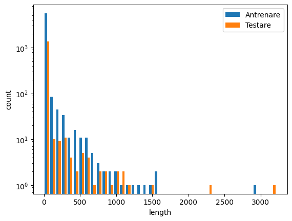
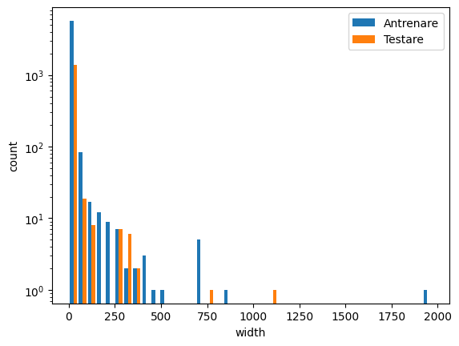

Distribuțiile pentru length și width sunt asimetrice, întrucât majoritatea covârșitoare a specimenelor sunt de dimensiuni mici, aspect evidențiat de scara logaritmică.

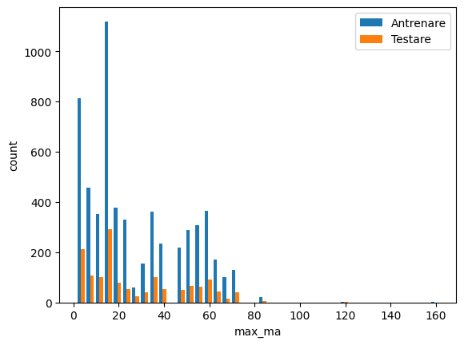
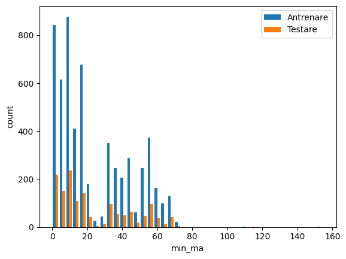

Vârstele max_ma și min_ma prezintă distribuții rezonabile. Se observă că aproape toate specimenele sunt din ultimele 70 de milioane de ani, iar fosilele din ultimele 20 de milioane sunt cele mai comune.

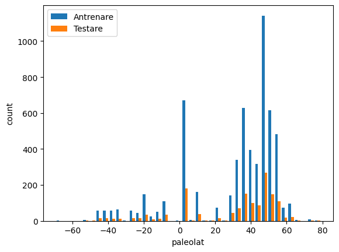
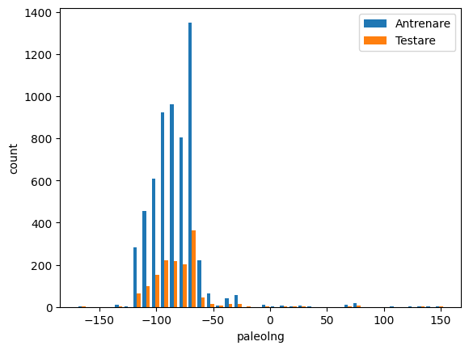

Coordonatele prezintă vârfuri pe anumite latitudini și longitudini, ceea ce reflectă principalele situri de excavație și continentele favorabile conservării din trecut (ceea ce se observă și mai clar în heatmap-ul ce urmează).

---

### Analiza distribuției variabilelor categorice

Am folosit **countplot-uri** pentru a analiza distribuțiile variabilelor categorice în setul de antrenare și în cel de testare.

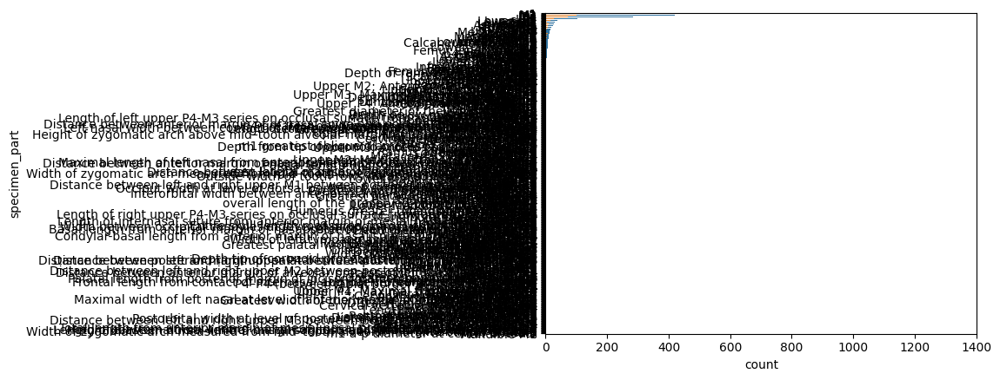

Acest grafic hidos pentru specimen_part confirmă faptul că dinții sunt cele mai frecvente părți fosilizate descoperite, fiind mult mai rezistenți decât restul scheletului.

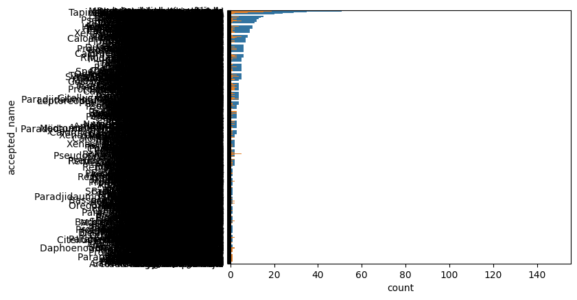

Acest grafic și mai hidos pentru accepted_name arată o distribuție dezechilibrată a speciilor, cauzată de repartiția neuniformă a fosilelor conservate.

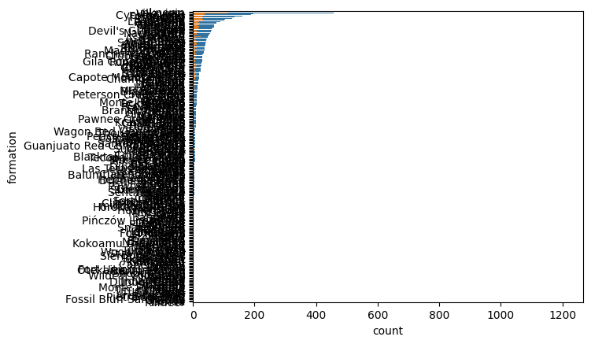
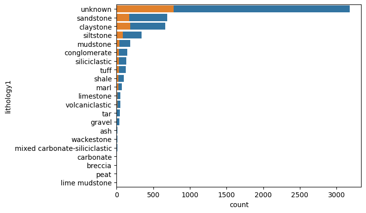
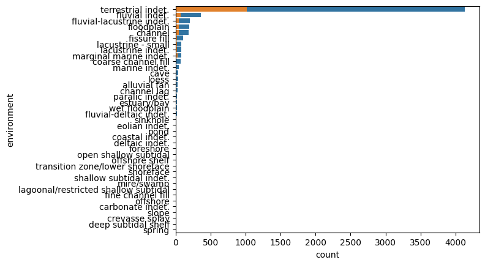

Variabilele legate de geologie sunt dominate de unele categorii suprareprezentate, cum ar fi roci nedeterminate pentru litologie și mediul terestru, posibil pentru că aceste circumstanțe ar duce la conservarea cea mai bună a fosielor mamiefere.

---

### Detectarea outlierilor

Pentru a evalua dispersia și extremele, am folosit grafice de tip **boxplot**.

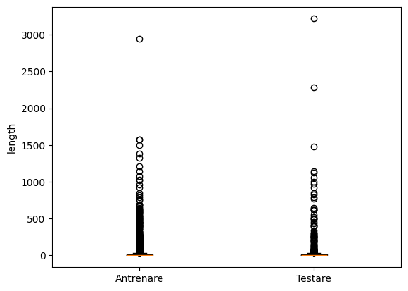
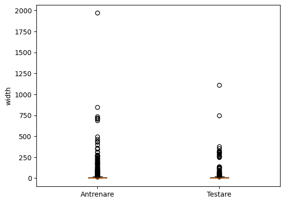

Graficele pentru length și width prezintă mulți outlieri deasupra marginii superioare a IQR-ului (fosile de câțiva decimetri sau chiar metri). Aceștia reprezintă megafauna, iar păstrarea lor este necesară dezvoltării modelului.

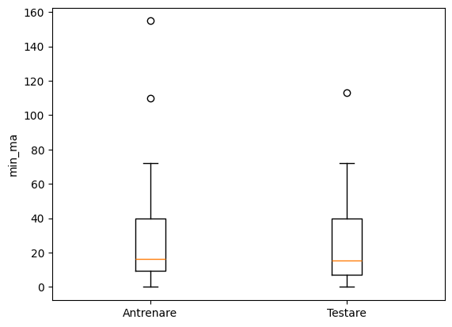
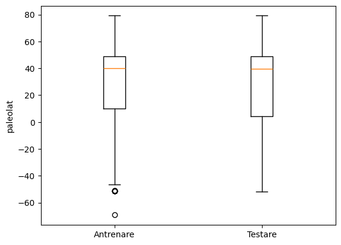
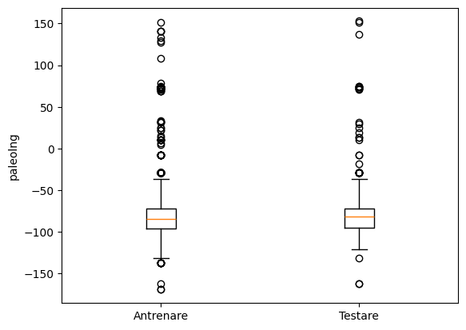

Vârstele și coordonatele au o dispersie mai ușoară. Outlierii reprezintă descoperiri din afara circumstanțelor temporare și spațiale obșinuite, care trebuie păstrate pentru a avea un set de date cât mai divers.

---

### Analiza corelațiilor

Pentru evaluarea corelațiilor, am folosit **heatmap-uri** pentru variabilele pereche.

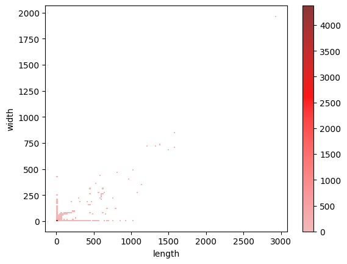

După cum este așteptat, există o corelație puternică între length și width. Cu toate acestea, se observă unele specimene pe marginile graficului (cu sute de milimetri în lungime și zero în lățime și vice-versa), ceea ce sugerează că ar exista date eronate.

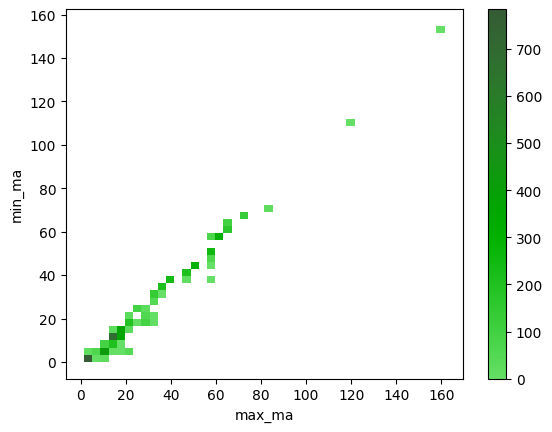

Vârstele max_ma și min_ma sunt foarte strâns legate și există valori deasupra diagonalei principale, după cum este de așteptat din partea legilor fizicii.

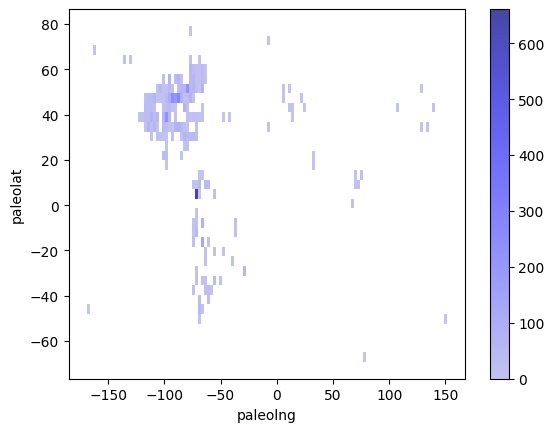

Harta coordonatelor este probabil cea mai interesantă: pe ea se pot observa umbrele continentelor așa cum erau în preistorie. Deoarece mamiferele sunt o apariție relativ recentă din punct de vedere geologic, regiuni contemporane (America de Nord, America de Sud, Europa, Orientul Mijlociu) se pot observa în grafic. Încă o dată, este evident volumul mare de fosile studiate în emisferele nordică și vestică.

---

### Relația cu variabila țintă

Am folosit **violinplot-uri** pentru reprezentarea relațiilor dintre fiecare variabilă și numele speciei. M-am limitat la doar 200 de rânduri din setul întreg, selectate randomizat, deoarece rularea pe setul complet ar fi supraaglomerat graficele (mai mult decât sunt deja) și scripturile ar fi rulat mult prea mult.

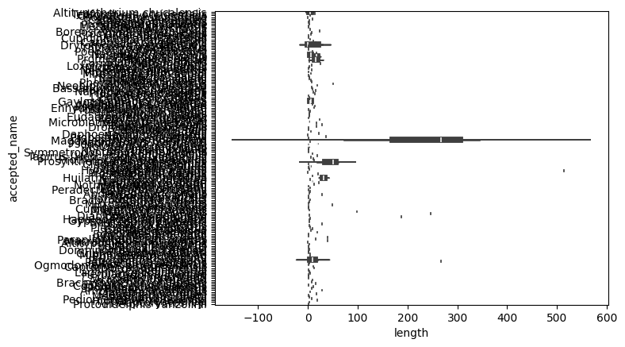
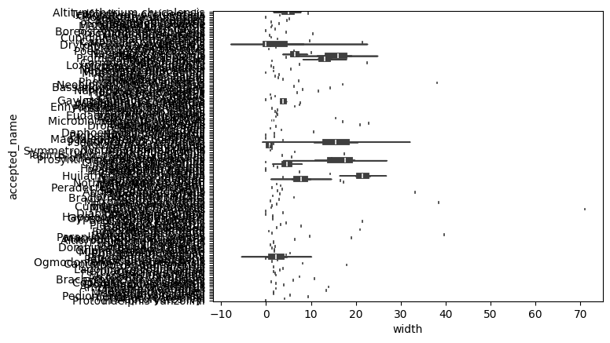

În aceste grafice foarte clare se poate observa faptul că dimensiunile variază de la o specie la alta, dar există o zonă mare de suprapunere care tinde spre zero. De aceea, length și width nu sunt suficiente pentru o clasificare precisă.

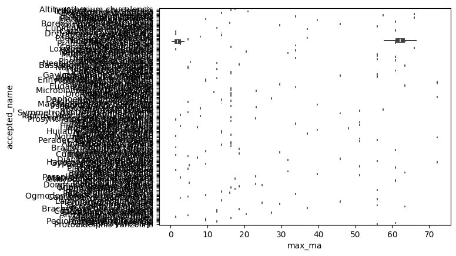
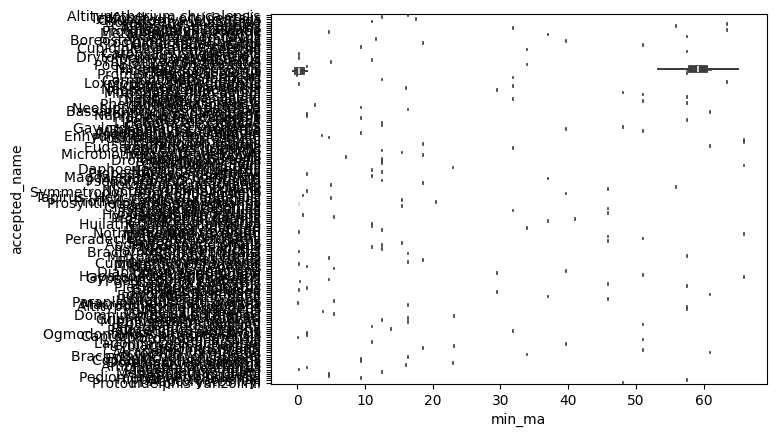

Graficele pentru vârste arată că speciile sunt izolate în intervale de timp foarte împrăștiate. De aceea, aceste variabile sunt cele mai importante pentru modelul de clasificare și nu pot avea valori eronate sau lipsă.

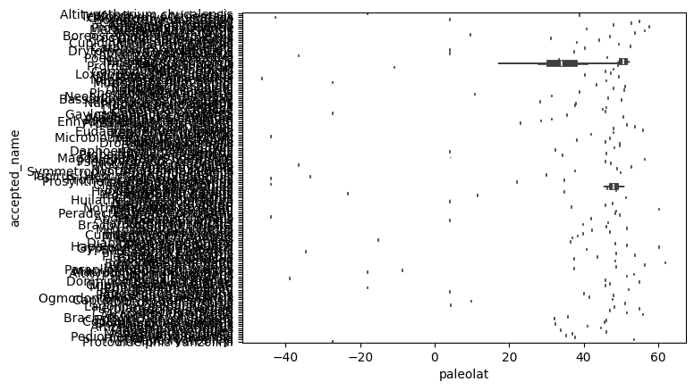
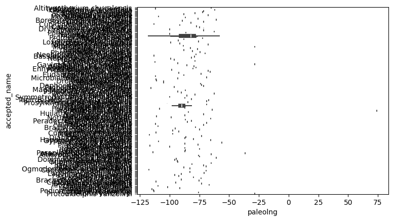

Coordonatele au și ele o împrăștiere destul de mare, așa că vor fi și ele foarte importante deciziilor luate de modelul de clasificare.

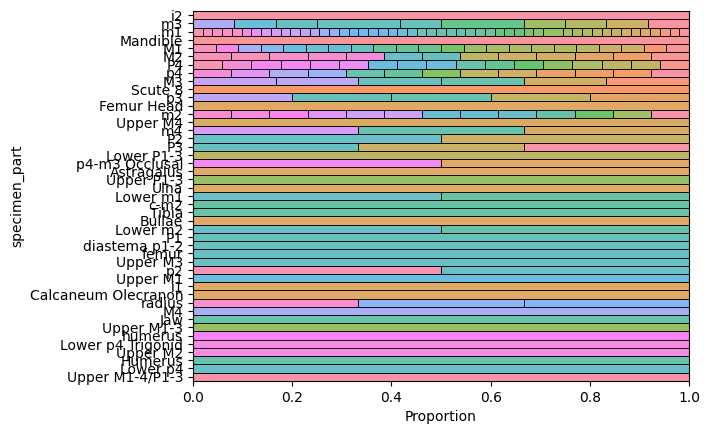
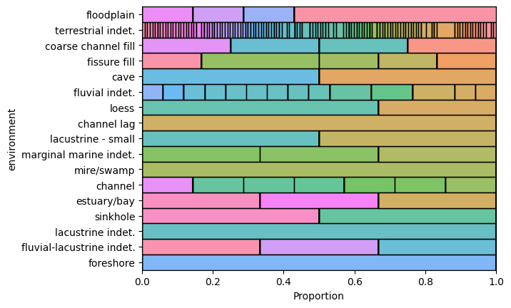
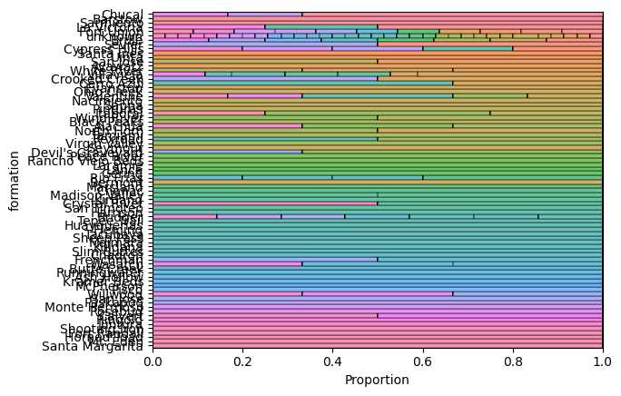
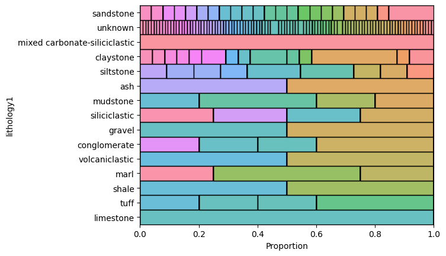

Graficele pentru variabilele categorice arată că unele specii vor fi mult mai ușor de găsit decât celelalte, astfel că probabil vor fi avantajate specimenele cu date geologice mai ezoterice și cu o parte anatomică măsurată cât mai puțin reprezentată.

---

### Antrenarea și evaluarea modelului de bază

Pentru **prepocesare**, variabilele categorice au fost codificate folosind LabelEncoder, iar variabilele numerice continue au fost scalate folosind MinMaxScaler și apoi StandardScaler (așa cum am învățat la laborator!).

Am ales algoritmul **RandomForestClassifier** (n_estimators=50, max_depth=30) din biblioteca scikit-learn, deoarece este un algoritm eficient și special dotat pentru problemele de clasificare.

Acuratețea modelului pe setul de testare a fost de **0.7792**.

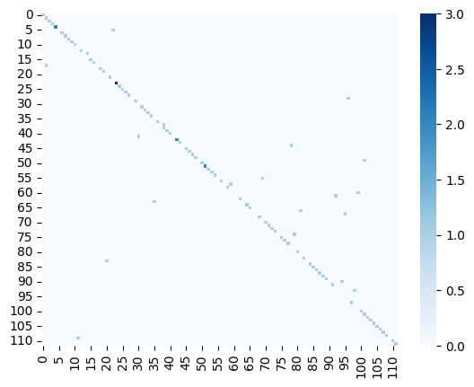

Matricea de confuzie (realizată doar pentru primele 100 de valori, deoarece altfel rămâneam fără RAM) arată performanța satisfăcătoare a algoritmului. Cu toate acestea, modelul s-a descurcat destul de bine, având în vedere natura extrem de dispersată a setului de date.

Modelele, encoderele și matricea de confuzie au fost serializate cu joblib pentru a fi integrate în interfața grafică, iar modelul de ~1.2 GB a primit numele de **Diego**, după tigrul cu dinți sabie din *Ice Age*.

---

### Interfața grafică

Folosind Gradio am creat **Fossil Fairy**, ce poate clasifica instantaneu orice fosilă descoperită de utilizator (sau, mai degrabă, inventată).

Datele pot fi introduse folosind câmpuri de input Dropdown pentru variabilele categorice, Slidere și Number pentru variabile numerice.

**Utilizatorul poate alege din mai multe modele antrenate** salvate în format .pkl (printre care și Diego!), cu precizii și viteze diferite. În același timp cu încărcarea modelului este afișată și matricea de confuzie corespondentă.

La apăsarea marelui buton **PREDICT**, sunt aplicate encoderele pentru inputuri, apoi Fossil Fairy prezice cele mai probabile 5 specii, afișând rezultatul sub formă de bare de certitudini.

---

### Rulare

Mai întâi, rulează cele trei blocuri din `basic_model.ipynb` pentru crearea modelului. Poți ajusta parametrii dacă dorești.
După aceea, rulează comanda `gradio app.py` în directorul Surse, după care se deschide interfața web. Enjoy!
